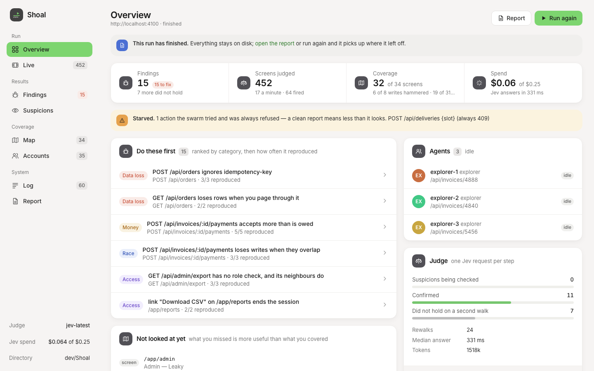
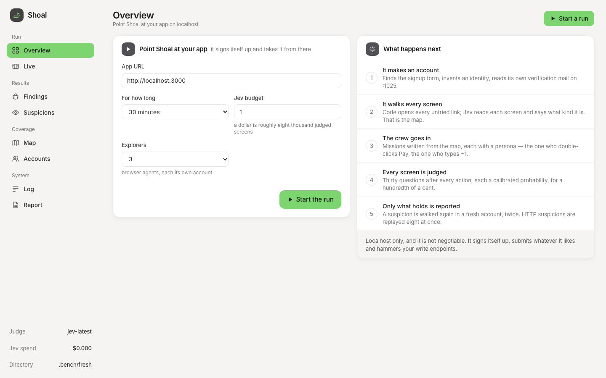
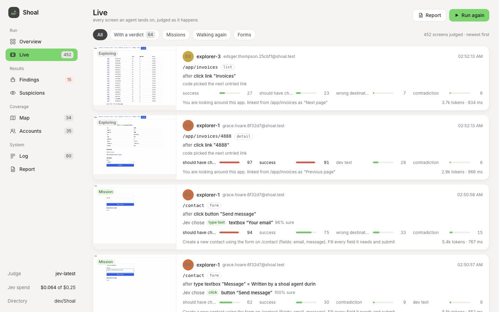
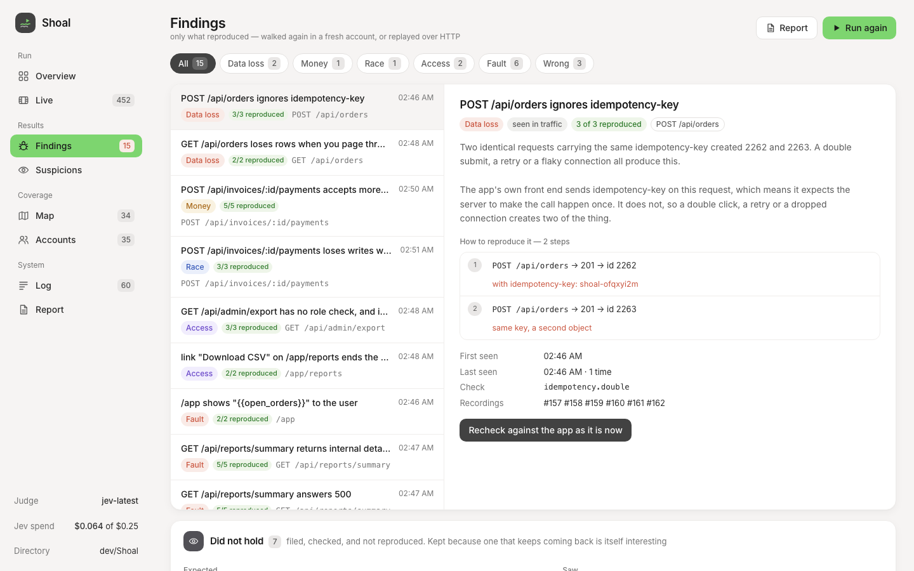

<div align="center">



# Shoal

**A swarm that uses your app in the browser and reads every screen for bugs.**

[](#try-it-in-two-minutes)
[](https://docs.typesafe.ai)
[](fixtures/leaky/BENCH.md)
[](LICENSE)

[Try it](#try-it-in-two-minutes) · [How it works](#how-it-works) · [What it finds](#what-it-finds) · [The dashboard](#the-dashboard) · [Numbers](#how-we-know-it-works) · [Design docs](#the-design)

</div>

---

Point it at your app on localhost. It signs itself up, walks every screen,
works out what the app does, then sends in a crew with goals and bad habits —
the one who double-clicks Pay, the one who types −1, the one who leaves a
required field empty. After every action, every screen is judged against a
contract of what a screen may not do. Ten minutes finds a few things. A day
finds about everything it is going to find.

You write nothing. No test files, no describing your app, no listing your
routes, no fixtures, no credentials. A URL and a [TypeSafe](https://typesafe.ai)
key are the whole setup.

```bash
shoal ui          # the front door: paste a URL, pick a duration, press the green button
```

---

## Why this is not another AI test generator

Most tools in this space ask a language model whether something looks wrong.
That produces a report full of confident nonsense, and one bad finding costs
more trust than nine good ones earn. The first version of Shoal reacted by
banning models from judging anything at all — and found only what an `if`
statement can prove from HTTP traffic. Backend bugs. Not one thing you would
see on a screen.

This version uses a different kind of model for the judging, and the
difference is the design:

> **Agents find. Calibrated judgments filter. Reproduction decides.**

The judge is [Jev](https://docs.typesafe.ai/introduction), a *System One*
model. It does not write. Send it a screen and a typed question — *does this
screen show two facts about one record that cannot both be true?* — and it
returns a calibrated probability, in about 300 ms, for a hundredth of a cent.
Thirty questions about one screen cost the same round trip as one. Every
answer is a number code can threshold, not a paragraph code has to believe.

A probability above 0.85 files a **suspicion**. Nothing reaches the report. A
confirmer then walks the same steps again **in a brand new account** and asks
the same question of the same screen, twice, and only what holds every time
becomes a **finding**. HTTP suspicions are still replayed at HTTP speed, eight
at once behind a barrier, with no model involved — the race-catching half of
the old design is intact. It just stopped being the only half.

And where the answer is a comparison, a count, a number or a date, there is no
model at all. Jev is asked whether the phone number is *shown*; code decides
whether the one shown is the one that was typed.

---

## Try it in two minutes

Requires **Node 20+** and a TypeSafe key from
[console.typesafe.ai](https://console.typesafe.ai). Playwright downloads
Chromium on first run.

```bash
git clone https://github.com/Aphrosidiac/Shoal && cd Shoal
npm install
npx playwright install chromium
echo 'TYPESAFE_API_KEY=...' > .env
```

Then, in the directory of the app you want tested (or right here, against the
deliberately broken app that ships with Shoal):

```bash
npm run fixture          # a deliberately broken app on :4100
npm run shoal -- doctor  # checks the six things that ruin a run, including one planted contradiction for Jev
npm run shoal -- ui      # http://localhost:7717 — paste the URL, pick a duration and a budget, start
```



Or from the terminal:

```bash
npm run shoal -- run http://localhost:4100 --for 30m --jev-max-usd 1
npm run shoal -- report
```

`--jev-max-usd` is a hard stop. A step costs about 3,000 input tokens at
$0.042 per million, so a dollar is roughly eight thousand judged screens.
There is no local-model option: the judging depends on calibrated
probabilities, and that is what Jev is trained for. The only thing that leaves
your machine is the visible text and control table of your app's screens.

To measure the judge on its own before trusting it with a run:

```bash
npm run judge            # every planted screen bug and non-bug, judged, for about a cent
```

---

## How it works

```
   http://localhost:3000
            │
            ▼
   SCOUT ── signs itself up and walks every untried link, in code.
     │      Jev reads each screen and says what kind it is. Writes the MAP.
     ▼
   MAP ──── pages, forms, fields, the API call behind each button,
     │      what leads where. Persistent — run #10 starts where #9 stopped.
     │      Missions are written from it by code: "make one, check it is there."
     ▼
   CREW ─── many agents, each with a persona and a goal. One Jev request
     │      per step: which control advances the goal (a closed set, never
     │      a string), what kind each field is (code picks the value), and
     │      thirty questions about what the last action did to the screen.
     │
     ├────► RECORDER ── every request and response, per agent, per
     │                  account, per screen, per app build
     ▼
   JUDGE ── code first (a regex, a count, a status against a message),
     │      then Jev's probabilities, thresholded. Suspicions, never findings.
   WATCHERS ─ deterministic checks over the recordings. No model. Ever.
     ▼
   CONFIRM ─ an HTTP suspicion is replayed at HTTP speed, eight at once
     │       behind a barrier. A screen suspicion is walked again in a fresh
     │       account and judged again. Did it happen every time?
     ▼
   REPORT ── only what happened again, with the shortest repro that
             still fails, and a count instead of a thousand rows.
```

Everything is one queue that never empties, scored as
`base(kind) × novelty × staleness × tilt`. Nobody writes a phase schedule:
early on the map is mostly holes so exploring wins, and as they fill it tips
toward hammering on its own. Missions never fade — they are the crew, and the
thing that puts data in the app.

### The personas

Behaviour, not demographics. Each one changes which code runs:

| | Value classes | Around a submit |
|---|---|---|
| the impatient one | | clicks it twice |
| the one who changes their mind | | back, forward, type it again, submit |
| the extremist | 0, −1, 999999 on numbers | |
| the copy-paster | emoji, quotes, `<tag>` in text | |
| the incomplete one | | leaves the first required field empty |
| the one who wandered off | | waits before pressing |
| the refresher | | reloads right after |
| the beginner · the regular · the tidy one | | a fresh account, or one with hundreds of rows |

Jev never writes a value that gets typed. It says what *kind* a field is; the
persona says which *class* of value to try; code owns the string — so a
rewalk types the same class again and means the same thing.

---

## What it finds

Every check below needs **zero** knowledge of what your app does, and none of
them require you to write anything.

### Through the screen

Judged after every action; confirmed by walking it again in a fresh account.

| | Caught by |
|---|---|
| a Save that does nothing | no change, no request, and a judgment that a user expected one |
| "Saved." on a request that failed | the recorder's status and the screen's word, side by side |
| a value accepted and shown differently afterwards | Jev says the field is shown; code says it is not that value |
| "Saved." over a list that was never refreshed | the list, counted, and the confirmation, read |
| a status and a control that cannot both be true | one question, one probability |
| a refused form that wipes what was typed | field values before and after, with an error on screen |
| a validation message about the wrong field, or a field the form does not have | two questions over what was entered and what was said |
| a link that opens the wrong screen | the label and the heading, compared |
| `undefined`, `NaN`, `{{template}}`, a stack frame, lorem ipsum | a regex, then a judgment for the ones a regex cannot name |
| a screen that never finishes loading | the network went quiet and "Loading…" is still the content |
| an ordinary click that lands on the login page | a password field that was not there before |
| user input rendered as HTML | a `<tag>` typed in, and the text came back without it |

### Through the traffic

Replayed at HTTP speed, no model anywhere.

| | Caught by |
|---|---|
| another account's data readable by id | a second account it signed up itself |
| a role reaching something it was not granted | a locked neighbour under the same path |
| a write accepted and silently dropped | reading it back through the app's own refetch |
| a stored figure disagreeing with its parts | the app's own numbers, compared |
| concurrent writes producing impossible state | a barrier volley, then read-back |
| a list that loses rows when you page it | walking every page and counting |
| a request that happens twice on one key | sending it twice on one key |
| 5xx, stack traces, SQL in a body, slow paths | the traffic alone |
| two endpoints disagreeing about one object | reading it both ways, back to back |

---

## The dashboard

`shoal ui` — or automatically on `shoal run`. Plain HTML, CSS and JavaScript
served by the Shoal process itself: no framework, no bundler, no build step,
because a dev tool that can fail to compile is one that stops you shipping.

The rail is grouped by what you came to do. **Overview** is the KPI strip,
*Do these first* and *Not looked at yet*, with the agents and the judge in
the right column. **Live** is a filmstrip of every judged screen — the
picture the agent was looking at, the action that led there, what Jev chose
next and how sure it was, the top probabilities, the verdicts. Click any
picture for the whole contract.



**Findings** and **Suspicions** are a list and a detail side by side: kind,
how often it reproduced, the evidence pictures from the rewalk, the numbered
repro steps, and a button to recheck it against the app as it is now.



---

## The six rules everything else follows from

1. **Localhost only.** Never production, never a live system, no exceptions.
   Shoal refuses to start against anything else — that is what lets agents be
   genuinely reckless.
2. **Agents find, calibrated judgments filter, reproduction decides.** No
   generative model may declare a bug. A typed probability may file a
   suspicion; only a second walk or a replay can confirm one.
3. **Anything code can compute, code computes.** Jev is never asked to count,
   compare a number, read a date, or write a value.
4. **Signup is the reset.** A fresh account is a fresh world. No database
   clone, no seed data, no fixtures.
5. **There is no "run".** A queue that never empties. Stop it whenever.
6. **Never report the same thing twice.** Three fingerprints — action, screen,
   finding — and deduplication is load-bearing, not a nicety.

---

## Running it from Claude Code

Shoal ships an MCP server, so Claude Code can operate it and confirmed findings
arrive in your session instead of a file you forget to open.

```bash
claude mcp add --scope user --transport stdio shoal -- npx shoal mcp
```

Then: *"start my dev server and point Shoal at it."* Tools are `shoal_start`,
`shoal_status`, `shoal_findings`, `shoal_finding`, `shoal_map`, `shoal_recheck`
and `shoal_stop`. Confirmed findings are pushed into the session as they are
confirmed, rather than waiting to be asked for. The loop it closes: a bug
lands in your session, you fix it, the dev server hot-reloads, Shoal notices
the new build and re-checks the finding by itself.
See [docs/claude-code.md](docs/claude-code.md).

---

## How we know it works

Shoal ships the app it is tested against: [`fixtures/leaky/`](fixtures/leaky),
a small orders-and-invoices app with **twenty-two known bugs** — eleven behind
the API, ten on the screen, and one nobody planted — and, just as
importantly, **eleven behaviours that look wrong and are not**.

```bash
npm run shoal -- bench --for 10m --label "what changed"
```

starts it fresh, runs against it, and prints five numbers. The real ones,
every run, in [`BENCH.md`](fixtures/leaky/BENCH.md):

| | The judge alone | Swarm, run 1 | Swarm, run 2 | Swarm, run 3 |
|---|---|---|---|---|
| planted bugs found | **10 of 10** screen bugs | 9 of 22 | 11 of 22 | **14 of 22** |
| false positives | **0** on 7 non-bug screens | 6 | 0 | **0** |
| wall clock | one scripted walk | 8 m | 10 m | 10 m |
| Jev spend | $0.002 | $0.13 | $0.05 | $0.06 |

Every one of run 1's false positives was a missing *code* gate — a submit the
browser itself refused, a sign-up link on a public page, one of two
double-submits answering 409 — and never a wrong probability. Each is written
down in [docs/decisions.md](docs/decisions.md) with what it cost.

The twenty-second bug is the one worth telling: the copy-paster typed `<tag>`
into a name field, the app said Saved, and the name came back without it. The
fixture had rendered user input as HTML from its first commit, and no HTTP
check could ever have seen it — the response body carried the text exactly as
stored. **A change that raises `found` and also raises `false positives` is
not an improvement**; recall on its own is a vanity metric.

---

## Commands

```
shoal ui                 the dashboard, and the front door (default :7717)
shoal run <url>          start a run, or continue the one in this directory
shoal status             what is happening right now
shoal report [--open]    regenerate report.md, report.txt and report.html
shoal findings [id]      list findings, or show one in full
shoal recheck <id>       re-run one finding against the app as it is now
shoal map                what it knows about the app, untouched things first
shoal stop               stop, leaving everything on disk
shoal reset [--all]      clear findings and traffic; --all clears the map too
shoal doctor             check the setup before wasting a run on it
shoal bench              score against the calibration fixture
shoal mcp                run as an MCP server on stdio

  --for 30m|24h  --jev-max-usd N  --explorers N  --hammerers N  --confirmers N
  --login email:password   an account to use when the app has no sign-up (or SHOAL_LOGIN)
  --pace N  --budget N  --no-ui  --redact  --verbose  --headed
```

`run` on a directory that already has a run **continues** it — throwing away a
day of mapping should not be one keystroke. Everything Shoal writes lives in
`.shoal/`, so deleting that removes it completely.

```jsonc
// shoal.config.json — every key optional
{
  "url": "http://localhost:3000",
  "explorers": 3, "hammerers": 16, "confirmers": 2,
  "rewalks": 2,                                   // fresh-account walks a screen suspicion must survive
  "jev": { "model": "jev-latest", "maxUsd": 1, "suspect": 0.85 },
  "logins": [],                                   // accounts to use when the app has no sign-up
  "planner": null                                 // optional generative tier for extra missions
}
```

Full flags and configuration: [docs/cli.md](docs/cli.md) ·
[docs/config.md](docs/config.md)

---

## What it will not do

Worth knowing before you point it at something.

- **It will not run against anything but localhost.** Not a staging box, not a
  VPN'd internal host. This is not a setting.
- **It cannot sign itself up on an OAuth-only or invite-only app.** Hand it
  an account — in the dashboard's start form, or `--login email:password` —
  and it uses that instead. The fresh-world guarantee is lost (missions and
  rewalks share the account) and the cross-account checks need two. If your
  app verifies email on sign-up, point its SMTP at `localhost:1025` and it
  reads its own verification links.
- **It needs a TypeSafe key.** The judging depends on calibrated
  probabilities, and Jev is the model trained for them. There is no local
  option.
- **It reads text, not pixels.** Overlap, overflow, contrast and colour are
  not judged. That is a different piece of work.
- **It is slow by nature, and that is the design.** Ten minutes is a smoke
  test. The interesting things — a list too big to page correctly, a query that
  is only slow once there are rows — cannot exist until it has spent hours
  putting data in.
- **A clean report means nothing without the coverage section.** An app where
  every write is being refused looks exactly like an app with no bugs, which is
  why starvation is printed *above* the verdict and never below it.

### Where it stands

Built, measured, and running end to end; the numbers above are every run, not
the flattering ones. Two things are honestly still open. The 24-hour unattended
run has not been done — the four screen bugs the swarm has not yet reached in
ten minutes need the persona rotation and the hours that a short run does not
have. And missions that need a chain (make an order, open its invoice, set its
status) reach the end only when the queue happens to serve them a cluttered
account. Both are at the top of [`BENCH.md`](fixtures/leaky/BENCH.md).

---

## Privacy

Recordings contain whatever is in your dev database, and all of it stays in
`.shoal/run.db` on your machine. One thing reaches a network: Jev, which is
sent page snapshots — headings, messages, the control table and visible text.
Run with `--redact` to scrub values from sensitive-looking fields before
anything is stored or sent.

---

## The design

Written before the code, and corrected where the code proved it wrong.

| | |
|---|---|
| [idea.md](docs/idea.md) | what this is for, what it deliberately is not, and the correction |
| [ai.md](docs/ai.md) | why a decision model may judge when an LLM may not; what Jev is never asked |
| [finding-bugs.md](docs/finding-bugs.md) | the screen contract, and catching bugs with no database access |
| [architecture.md](docs/architecture.md) | the pieces and how they fit |
| [agent-loop.md](docs/agent-loop.md) | one request per step, the personas, the missions |
| [long-runs.md](docs/long-runs.md) · [scheduler.md](docs/scheduler.md) | the queue, coverage, what 24 hours buys |
| [recording.md](docs/recording.md) | fingerprints, replay, hammering, shrinking |
| [claude-code.md](docs/claude-code.md) | MCP, the channel, and the subscription traps |
| [calibration.md](docs/calibration.md) | the fixture, and `shoal bench` |
| [ui.md](docs/ui.md) | the dashboard: the flow and the language |
| [modules.md](docs/modules.md) · [schema.md](docs/schema.md) | the source tree and the store |
| [cli.md](docs/cli.md) · [config.md](docs/config.md) | commands, knobs, packaging |
| [risks.md](docs/risks.md) | what will go wrong |
| **[decisions.md](docs/decisions.md)** | **every decision, the sixteen the first build corrected, and the rebuild** |

The repo history contains two earlier, different tools that were deleted on
purpose — [idea.md](docs/idea.md) says why each time.

---

<div align="center">

MIT. It is a developer tool that only ever talks to localhost; open source is
the only version of it anybody should trust.

Built with [TypeSafe Jev](https://typesafe.ai) · the driving heads are ported from
[browser-use/jev-ultrafast](https://github.com/browser-use/jev-ultrafast)

</div>
